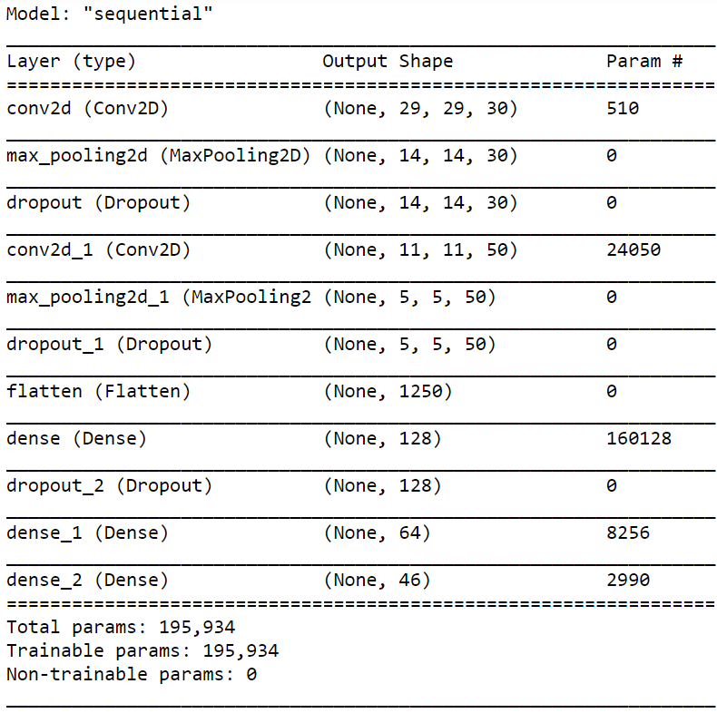

# devanagari-character-digit-recognition
Character recognition of Hindi handwritten single characters and digits using CNN.

## Contents
* [Overview](#overview)
* [Motivation](#motivation)
* [Dataset](#dataset)
* [Setup](#setup)
* [Repository files](#repository-files)
* [Model](#model)
* [What did I learn](#what-did-i-learn)

## Overview
A simple image recognition model to recognize Hindi handwritten character and digits from an image of size (32, 32).

  

## Motivation
The image classification problem with MNIST image dataset is considered a very standard problem to learn and practice how to develop, evaluate and use the deep neural networks. So, after completing that project, I worked on classifying devanagari characters using convolutional layers to understand the effects of changing the hyperparameters on the accuracy and the performance of a CNN model.

## Dataset
The dataset was downloaded from Kaggle 
Website: [devanagari-character-set](https://www.kaggle.com/rishianand/devanagari-character-set)

## Setup
Windows 10 
python 3.7 
tensorflow-gpu==2.1.0

## Repository files
devanagari_character_digit_recognition.ipny - jupyter notebook 
devanagari_character_digit_recognition_model.h5 - saved model after 30 epochs 
model_layers.png - layers used in my model

## Model

  

## What did I learn?
#### Problem: Loss function was decreasing but oscillating
Solution: 
Reducing the learning rate, use momentum on SGD (or better, use momentum based optimizers like Adam)
#### Problem: Difference in final values of valdaition and training accuracy
Solution: 
Underfitting - val and train accuracy low 
Overfitting - high train accuracy, low val accuracy 
Good fit - val accuracy close to train accuracy and both are high 
Unknown fit - high val accuracy, low train accuracy 

My model was facing overfitting, so I increased the batch size and added dropout layers.
